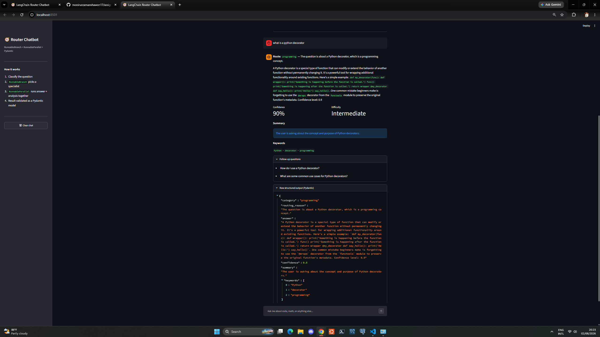
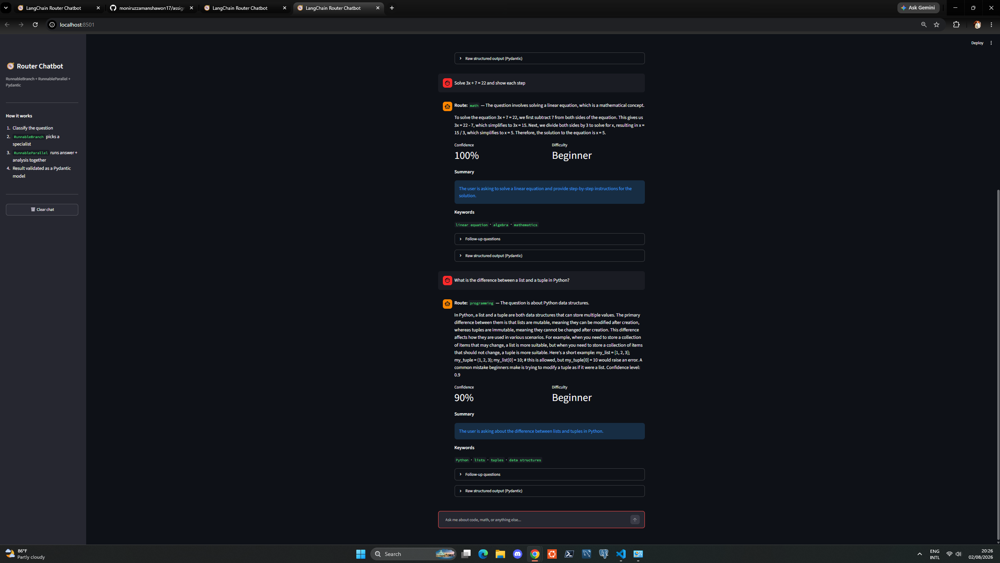
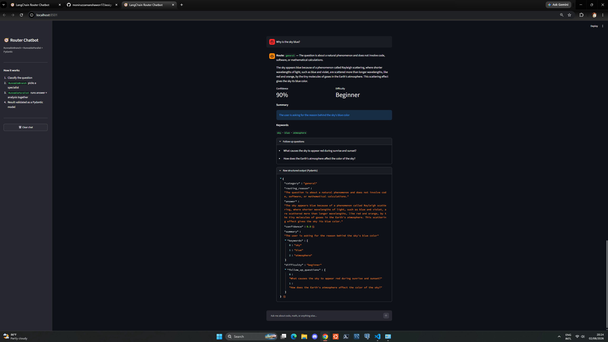

# LangChain Router Chatbot

An AI chatbot built with LangChain (LCEL) and Streamlit that routes each question to a
specialist prompt, generates two outputs concurrently, and returns a validated Pydantic
object instead of free-form text.

---

## Project Overview

Most simple chatbots send every question through the same prompt. This project does three
things differently:

1. **Classifies** the incoming question into one of three categories.
2. **Routes** it with `RunnableBranch` to a dedicated specialist prompt (programming, math,
   or general).
3. **Runs two chains at once** with `RunnableParallel` — one produces the answer, the other
   analyses the question — then merges both into a single Pydantic model that the UI renders.

The result is a response that carries not just an answer, but a confidence score, a summary,
keywords, a difficulty rating, and suggested follow-up questions.

### Pipeline

```
                        User Question
                              │
                              ▼
                   Classifier (QuestionRoute)
                              │
                              ▼
                       RunnableBranch
         ┌────────────────────┼────────────────────┐
         │                    │                    │
   Programming              Math                General
     Prompt                Prompt                Prompt
         └────────────────────┼────────────────────┘
                              ▼
                      RunnableParallel
                   ┌──────────┴──────────┐
              Answer chain          Insights chain
           (answer, confidence)   (summary, keywords,
                   │               difficulty, follow-ups)
                   └──────────┬──────────┘
                              ▼
                   ChatResponse (Pydantic)
                              │
                              ▼
                       Streamlit Chat UI
```

---

## Features

- Automatic question classification into programming / math / general
- Three specialist prompts, each with its own persona and answering style
- Concurrent answer generation and question analysis
- Fully validated structured output — no raw string parsing anywhere
- Confidence score and difficulty rating on every response
- Auto-generated summary, keywords, and follow-up questions
- Streamlit chat interface with persistent history
- Expandable panel showing the raw Pydantic JSON
- Clear chat button
- API key loaded from `.env`, never hardcoded

---

## RunnableBranch Implementation

`RunnableBranch` needs a value to test against, so a classifier chain runs first and labels
the question. Its output is bound to the `QuestionRoute` schema, which forces the model to
return one of exactly three enum values.

```python
classifier_chain = CLASSIFIER_PROMPT | llm.with_structured_output(QuestionRoute)
```

The labelled dict then flows into the branch. Conditions are evaluated top to bottom and
**only the first match runs**; the final bare runnable is the default route.

```python
answer_branch = RunnableBranch(
    (lambda x: x["category"] == Category.PROGRAMMING, programming_chain),
    (lambda x: x["category"] == Category.MATH, math_chain),
    general_chain,  # default route
)
```

Using an `Enum` rather than a plain string matters here: if the model returned `"Programming"`
or `"coding"`, a string comparison would silently fall through to the default and the routing
would appear broken while raising no error.

The chosen route and the classifier's reasoning are both displayed in the UI, so the branching
decision is visible on every response.

---

## RunnableParallel Implementation

Once a route is selected, two independent chains run concurrently on the same question:

```python
parallel_stage = RunnableParallel(
    answer=answer_branch,      # branch-specific answer
    insights=insights_chain,   # route-independent analysis
    route=RunnablePassthrough(),
)
```

- **`answer`** — the branched chain, producing the answer and a confidence score.
- **`insights`** — analyses the question without answering it, producing a summary, keywords,
  difficulty, and follow-up questions.
- **`route`** — `RunnablePassthrough()` carries the classification forward so it survives into
  the final merge.

The two branches do genuinely different work. `INSIGHTS_PROMPT` explicitly instructs the model
*not* to answer the question, which keeps the parallelism meaningful rather than duplicating
effort.

A final `RunnableLambda` merges all three keys into one object:

```python
return classify_stage | parallel_stage | RunnableLambda(merge_results)
```

---

## Pydantic Structured Output Implementation

Every LLM call is bound to a schema via `.with_structured_output()`. No `StrOutputParser`
is used anywhere in the project.

| Schema | Used by | Purpose |
|---|---|---|
| `QuestionRoute` | Classifier | Category enum + routing reason |
| `Answer` | All three branches | Answer text + confidence |
| `Insights` | Parallel branch 2 | Summary, keywords, difficulty, follow-ups |
| `ChatResponse` | Final merge | The single object rendered by the UI |

Constraints are enforced, not decorative:

```python
class Answer(BaseModel):
    answer: str = Field(description="A complete, well-explained answer.")
    confidence: float = Field(ge=0.0, le=1.0, description="Confidence from 0.0 to 1.0.")
```

A confidence value outside `0.0–1.0` raises a `ValidationError`. `Insights.keywords` requires
between three and six items. `Category` and `Difficulty` are enums, so invalid values cannot
pass through.

The `Field(description=...)` strings are not comments — LangChain converts the schema into a
JSON tool definition and sends those descriptions to the model, so they function as prompt
instructions.

---

## Project Structure

```
assignment-1-ml/
│
├── app.py              # Streamlit chat interface
├── chatbot.py          # RunnableBranch + RunnableParallel pipeline
├── prompts.py          # All PromptTemplate definitions
├── schemas.py          # Pydantic response schemas
├── requirements.txt
├── .env.example
├── .gitignore
├── README.md
└── assets/             # Screenshots
```

Each module has one responsibility: prompts hold no logic, schemas hold no prompts, and
`chatbot.py` composes them without containing any prompt text of its own.

---

## Installation

**1. Clone the repository**

```bash
git clone https://github.com/YOUR_USERNAME/assignment-1-ml.git
cd assignment-1-ml
```

**2. Create and activate a virtual environment**

Windows:
```powershell
python -m venv .venv
.\.venv\Scripts\Activate.ps1
```

macOS / Linux:
```bash
python3 -m venv .venv
source .venv/bin/activate
```

**3. Install dependencies**

```bash
pip install -r requirements.txt
```

**4. Configure your API key**

Copy the example file and add a free key from [console.groq.com/keys](https://console.groq.com/keys):

```bash
cp .env.example .env     # Windows: copy .env.example .env
```

Then edit `.env`:

```
GROQ_API_KEY=your_actual_key_here
GROQ_MODEL=llama-3.3-70b-versatile
```

**5. Run the app**

```bash
streamlit run app.py
```

Open `http://localhost:8501`.

---

## Usage

Try one question per route to see the branching in action:

| Question | Expected route |
|---|---|
| What is a Python decorator? | `programming` |
| Solve 3x + 7 = 22 | `math` |
| Why is the sky blue? | `general` |

The route and the classifier's reasoning appear at the top of every response. Expand
**Raw structured output (Pydantic)** to inspect the validated JSON.

---

## Tech Stack

| Component | Choice |
|---|---|
| LLM | Groq — `llama-3.3-70b-versatile` |
| Framework | LangChain Core (LCEL) |
| Validation | Pydantic v2 |
| UI | Streamlit |
| Config | python-dotenv |

Only `langchain-core` and `langchain-groq` are installed — the legacy `langchain` package,
which contains deprecated APIs such as `LLMChain` and `SequentialChain`, is deliberately
excluded. The entire pipeline uses LCEL pipe syntax.

---

## Screenshots

| Programming route | Math route |
|---|---|
|  |  |

| General route | Structured output |
|---|---|
|  |  |

---

## Notes

`.env` is excluded via `.gitignore`. Only `.env.example` with placeholder values is committed.